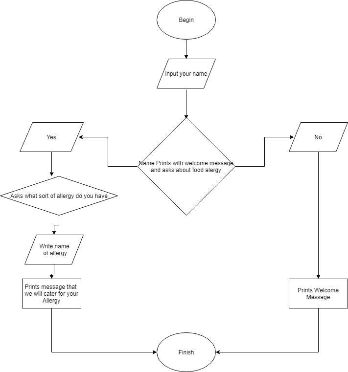

# Software Development Plan

More Actions**Statement of Purpose and Scope**  T1A2-1**Develop** a statement of **purpose** and **scope** for your application. It must include: - **describe** at a high level what the application will do - **identify** the problem it will solve and **explain** why you are developing it - **identify** the target audience  - **explain** how a member of the target audience will use it  Glossary **Describe** means to provide detail. **Identify** means to make a statement or name something. **Explain** means to provide detailed reasons/information relating to why or how something works300 - 500 words.  Please include this in your **software development plan** as a separate section with an appropriate heading.CMP1041-3.1

  300 - 500 words.

Please include this in your **software development plan** as a separate section with an appropriate heading.  

| **Features** |                                                              |                                                              |             |
| ------------ | ------------------------------------------------------------ | ------------------------------------------------------------ | ----------- |
| T1A2-2       | **Develop** a list of features that will be included in the application. It must include: - at least THREE **features** - **describe** each feature   **Ensure** that your features include the following language elements and concepts: - use of variables and the concept of variable scope - loops and conditional control structures - error handling   **Note:** If the features you described do not require you to use all of the above it is likely that your application is not sophisticated enough. **Consult with your educator**to check your features are sufficient to address the criteria for T1A2-7. | 300 words (approx. 100 words per feature)  Please include this in your **software development plan** as a separate section with an appropriate heading. | CMP1041-3.1 |

## Features:

### Customer Enters name:

### Def: get_name

Captures the tourists name as a variable for use in the program on the tour and also for reference in the future. It is captured by a input command and made into a Global variable by being returned to the program called "name"

### Def: allergy

Captures a response to the question of, if the tourist has a food allergy and if they don't answer N, they are asked to explain what it is called. There is further development needed on this feature to properly utilise and store this information so that they can be catered for. 

To ensure that we avoid ambiguity, for any answer other than N, the program will ask what food allergy the tourist has. This isn't very user friendly as the answer might even be No, but that means that they haven't fully understood the question because it does ask for a Y or N as the answer, but at this stage I'm going for safety over user experience. There is however an "if" statement to allow upper and lower case answers to be accepted equally to partially mitigate this lack of subtlety. 

### def dob

I wanted to capture the tourists date of birth for all sorts

### 

So that any food allergy is captured any answer except N will cause the program to ask the queston again until a test is included to ensure that the answer fits the criteria (Y, N,Yes, NO) if not they are prompted to try again and the program won't run any further unless they give one of these answers. 

| **User Interaction and Experience** |                                                              |                                                              |                          |
| ----------------------------------- | ------------------------------------------------------------ | ------------------------------------------------------------ | ------------------------ |
| T1A2-4                              | **Develop** an **outline** of the user interaction and experience for the application. Your outline must include: - how the user will find out how to interact/use each feature - how the user will interact/use each feature - how errors will be handled by the application and displayed to the user | Please include this in your **software development plan** as a separate section with an appropriate heading. | CMP1041-2.1, CMP1041-2.3 |

| **Control Flow Diagram** |                                                              |                                                              |             |
| ------------------------ | ------------------------------------------------------------ | ------------------------------------------------------------ | ----------- |
| T1A2-5                   | **Develop** a diagram which describes the control flow of your application. You diagram must: - show the workflow/logic and/or integration of the features in your application for each feature. - utilise a recognised format or set of conventions for a control flow diagram, such as UML. | Please provide a image file or PDF of your diagram.  Please include this in your **software development plan** as a separate section with an appropriate heading. | CMP1041-3.2 |

Copy from draw.io

| **Implementation Plan** |                                                              |                                                              |             |
| ----------------------- | ------------------------------------------------------------ | ------------------------------------------------------------ | ----------- |
| T1A2-6                  | **Develop** an implementation plan which: - **outlines** how each feature will be implemented and a checklist of tasks for each feature - prioritise the implementation of different features, or checklist items within a feature - provide a deadline, duration or other time indicator for each feature or checklist/checklist-item | You must submit this as a written document, ideally in a tabular format, and it is suggested that you enter your checklists into an appropriate project management application to assist you in completing T1A2-10.  Your checklists for each feature should have at least 5 items. | CMP1041-3.3 |

Make a table replicating Trello;

Feature; Priority; deadline

| **Development Log** |                                                              |                                                              |             |
| ------------------- | ------------------------------------------------------------ | ------------------------------------------------------------ | ----------- |
|                     | Write **TWO** status updates on your application. You must write a status update when: - you significantly change a feature or your implementation plan at any point  - encounter a significant issue, challenge or roadblock - are halfway through implementing the features - prior/after testing the application | You should submit these logs throughout the course of developing your application.  Each status report should be between 100 - 200 words.  The **Development Log** should be written in markdown and placed in a file named `development-log.md` in the root of your source control repository. Ensure you put the date of the log at the top of each log entry.  Please send your log to your educator as a markdown file as you complete them. This is so we can provide you with feedback. | CMP1041-2.2 |

| -10  | **Design** a help file which includes a set of instructions which accurately **describe**how to use and install the application.   You must include: - steps to install the application - any dependencies required by the application to operate - any system/hardware requirements - a written explanation of the different features of the application | The help file should be 100 - 200 words. | CMP1041-4.2 |
| ---- | ------------------------------------------------------------ | ---------------------------------------- | ----------- |
|      |                                                              |                                          |             |

recorded in Readme

| **Test Application** |                                                              |      |             |
| -------------------- | ------------------------------------------------------------ | ---- | ----------- |
| T1A2-11              | **Design** TWO tests which check that the application is running as expected.   Each test should: - cover a different feature of the application - state what is being tested - provide at least TWO test cases and the expected results for each test case  An **outline** of the testing procedure and cases should be included with the source code of the application and written in markdown. |      | CMP1041-4.1 |

Explain the test cases